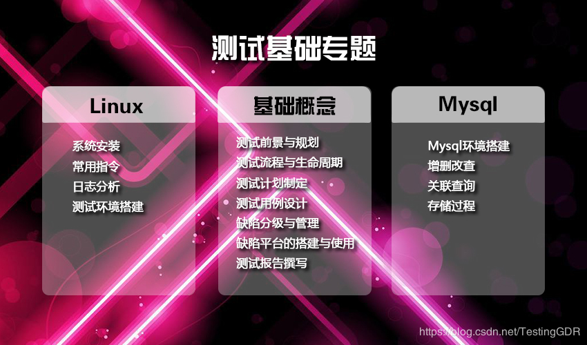

# 测试

以下是我自己这么多年的测试经验总结出的一套测试学习体系！希望对你有帮助！

一、必学基础

不管是做什么工作，基础都是非常重要的，首先我们进入一个行业的基本要求就是对这个行业的认识以及工作的流程了解清楚。一下就是我总结的测试工程师应该必备的基础知识：

1.测试基础概念

2.mysql数据库



二、接口测试技术

接口测试是测试系统组件间接口的一种测试。接口测试主要用于检测外部系统与系统之间以及内部各个子系统之间的交互点。测试的重点是要检查数据的交换，传递和控制管理过程，以及系统间的相互逻辑依赖关系。接口测试需要学习的知识有：

1.接口测试的原理

2.抓包工具的使用

3.接口测试工具

4.协议拓展，正则表达式，数据处理

三、自动化技术

自动化测试作为测试行业需求最大的技术点，招聘要求随处可见，进阶高级测试工程师必会点之一。什么？你不会代码？学！什么？你代码基础薄弱？学！一句话，如果你连自动化都不会，那么你敢说自己是高级测试工程师？自动化需要学习的东西如下：

1.自动化化基础原理

2.webUI与Selenium框架

3.app自动化和Appium框架

4.robootFramework自动化工具

四、性能测试技术

性能测试是通过自动化的测试工具模拟多种正常、峰值以及异常负载条件来对系统的各项性能指标进行测试。负载测试和压力测试都属于性能测试，性能测试需要掌握的知识有一下几点：

1.性能测试基础概念

2.性能工具lr

3.性能调优

4.性能报告方案

如何一起学习，有没有免费资料？

为了让学习变得轻松、高 ———————————————— 版权声明：本文为CSDN博主「TestingGDR」的原创文章，遵循 CC 4.0 BY-SA 版权协议，转载请附上原文出处链接及本声明。 原文链接：[https://blog.csdn.net/TestingGDR/article/details/83893090](https://blog.csdn.net/TestingGDR/article/details/83893090)

