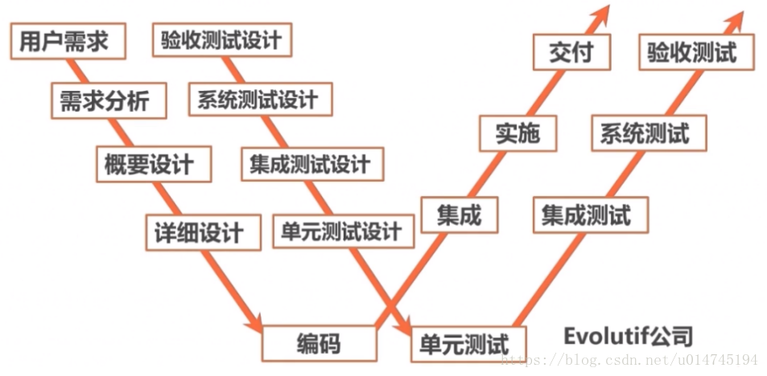

# 测试模型

## 软件测试五大模型

W模型是V模型的发展，强调的是测试伴随着整个软件开发周期，而且测试的对象不仅仅是程序，需求、功能和设计同样要测试。测试与开发是同步进行的，从而有利于尽早地发现问题。

W模型也有局限性。W模型和V模型都把软件的开发视为需求、设计、编码等一系列串行的活动，无法支持迭代、自发性以及变更调整。

（以下这段话转自某某的总结）

W模型和V模型都把软件的开发视为需求、设计、编码等一系列串行的活动。同样，软件开发和测试保持一种线性的前后关系，需要有严格的指令表示上一阶段完全结束，才可以正式开始下一个阶段。这样就无法支持迭代、自发性以及变更调整。对于当前很多文档需要事后补充，或者根本没有文档的做法\(这已成为一种开发的文化\)，开发人员和测试人员都面临同样的困惑。

