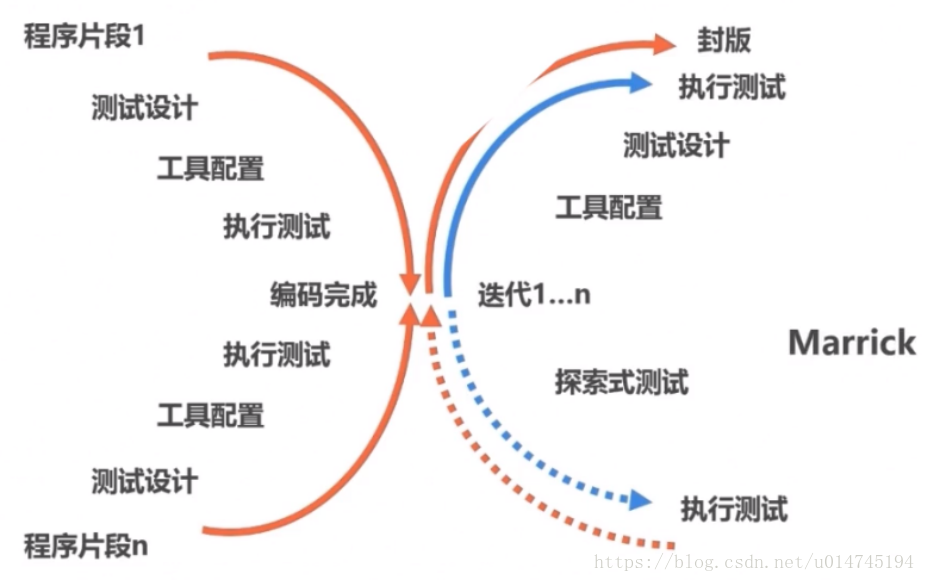

# 测试模型

## 软件测试五大模型

### W模型

W模型是V模型的发展，强调的是测试伴随着整个软件开发周期，而且测试的对象不仅仅是程序，需求、功能和设计同样要测试。测试与开发是同步进行的，从而有利于尽早地发现问题。

W模型也有局限性。W模型和V模型都把软件的开发视为需求、设计、编码等一系列串行的活动，无法支持迭代、自发性以及变更调整。

（以下这段话转自某某的总结）

W模型和V模型都把软件的开发视为需求、设计、编码等一系列串行的活动。同样，软件开发和测试保持一种线性的前后关系，需要有严格的指令表示上一阶段完全结束，才可以正式开始下一个阶段。这样就无法支持迭代、自发性以及变更调整。对于当前很多文档需要事后补充，或者根本没有文档的做法\(这已成为一种开发的文化\)，开发人员和测试人员都面临同样的困惑。

### X模型

X模型的左边描述的是针对单独程序片段所进行的相互分离的编码和测试，此后将进行频繁的交接，通过集成最终成为可执行的程序，然后再对这些可执行程序进行测试。

己通过集成测试的成品可以进行封装并提交给用户，也可以作为更大规模和范围内集成的一部分。多根并行的曲线表示变更可以在各个部分发生。

由图中可见，X模型还定位了探索性测试，这是不进行事先计划的特殊类型的测试，这一方式往往能帮助有经验的测试人员在测试计划之外发现更多的软件错误。但这样可能对测试造成人力、物力和财力的浪费，对测试员的熟练程度要求比较高。

总结：软件测试模型对指导测试工作的进行具有重要的意义，但任何模型都不是完美的。

事实上，随着软件质量要求越来越为大家所重视，软件测试也逐步发展成为一个独立于软件开发的一系列活动，就每一个软件测试的细节而言，它都有一个独立的操作流程。比如，现在的第三方测试，就包含了从测试计划和测试用例编写，到测试实施以及测试报告编写的全过程，这个过程在H模型中得到了相应的体现，表现为测试是独立的。也就是说，只要测试前提具备了，就可以开始进行测试了。

因此，在实际的工作中，我们要灵活地运用各种模型的优点，在W模型的框架下，运用H模型的思想进行独立的测试，并同时将测试与开发紧密结合，寻找恰当的就绪点开始测试并反复迭代测试，最终保证按期完成预定目标。

